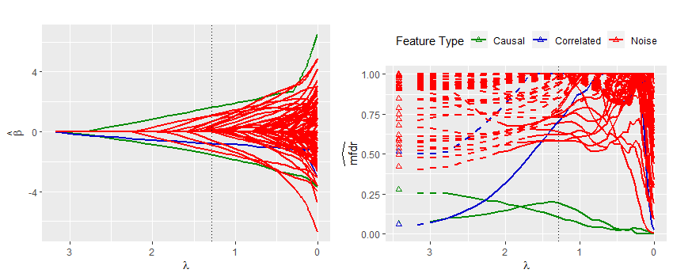

Much of my methodological research pertains to high-dimensional data, or situations where the number of variables available for analysis is large.  Specifically, I'm interested in penalized regression models and false discovery rate approaches to inference.  High-dimensional data frequently arise in the areas of genetics and genomics, but as the size and complexity of modern data continue to grow these methods have become popular in many other applications as well.  My contributions involve false discovery rate based approaches to inference, many of which are implemented in the R package [ncvreg](https://cran.r-project.org/web/packages/ncvreg/index.html) developed and maintained by my dissertation advisor [Patrick Breheny](http://myweb.uiowa.edu/pbreheny/index.html).  A description of these contributions, a short sampling of applied research I've worked on, and some other statistical interests of mine are provided below.

### Marginal False Discovery Rates for Penalized Likelihood Models

When analyzing high-dimensional data an inherent concern is the increased potential for false discoveries due to the large number of predictor variables that are being considered.  Despite these concerns very few approaches are available for assessing the false discovery rates of sparse likelihood-based models, such as penalized logistic or Cox regression models.  This work derives a general approach for controlling the false discovery rate of any penalized likelihood-based model.  The method applies to many popular penalizations schemes, including [LASSO](http://statweb.stanford.edu/~tibs/lasso.html), [elastic net](https://en.wikipedia.org/wiki/Elastic_net_regularization), [SCAD, and MCP](http://myweb.uiowa.edu/pbreheny/7600/s16/notes/2-29.pdf).  The approach is conservative, but it is also fast, flexible, and robust in situations where the data violate the method's underlying assumptions.

Details can be found here: [pdf link](https://arxiv.org/pdf/1710.11459.pdf)

### Feature Specific Inference using Local False Discovery Rate 

It is useful to know the overall false discovery rate of a given model, but what about the individual variables in the model?  This work answers that question using a [local approach to false discovery rates](http://statweb.stanford.edu/~ckirby/brad/LSI/chapter5.pdf).

 

The figure above displays modeling results from a single simulated data set containing various types of variables (features).  The left panel shows the standard LASSO coefficient path that is returned by default from most standard software packages such as [glmnet]( https://cran.r-project.org/web/packages/glmnet/index.html).  From this path it is difficult to distinguish between important features and noise.  The cross-validated model, which is indicated by the dotted vertical line, contains several noise variables that cannot be easily identified using just the coefficient path.  The right panel displays each feature's local marginal false discovery rate (mfdr) along the same sequence of models.  This approach is capable of clearly distinguishing between important variables and noise; the method characterizes each of the noise variables in the cross-validated model as having a greater than 50% chance of being a false discovery.

Details on the method can be found here: [ncvreg website](http://pbreheny.github.io/ncvreg/)

### Marginal False Discovery Rate Approaches for Group LASSO Models

In many modeling applications the predictor variables are not unrelated entities, but rather are members of structured groups.  Some common examples include groups of binary indicator variables representing a single categorical variable, or basis expansions aimed at capturing the non-linear effects of a continuous variable.  The [group LASSO](http://myweb.uiowa.edu/pbreheny/7600/s16/notes/4-27.pdf) is an extension of the LASSO that is well-suited for these applications and achieves sparsity at the group level rather than the individual level.  My work in this domain primarily involves group level false discoveries, however I'm generally interested in grouped or hierarchical variable selection approaches.

Details can be found here: (Link to come)

### Iowa Medicaid Expansion

As states sought to expand Medicaid under the Affordable Care Act, Iowa adopted an expansion model based upon personal responsibility.  As part of this expansion some recipients were required to pay a monthly premium; however, these premiums would be waived if the member completed Iowa's Healthy Behaviors Program.  Members who did not complete the requisite behaviors and did not pay their monthly premium were disenrolled from the program.  The project I'm involved with seeks to understand who is being disenrolled using claims and encounter data.  This work has been sponsored by the [Iowa Public Policy Center](http://ppc.uiowa.edu/), and is a collaborative effort with [Natoshia Askelson](http://ppc.uiowa.edu/people/natoshia-askelson), [Elizabeth Momany](http://ppc.uiowa.edu/people/elizabeth-momany).

```{r, echo=FALSE, fig.width=11, fig.height=4}
load(file = "medicaid_plot.RData")
p_ex
```

The above figure shows some modeling results from our research, plotting model predicted disenrollment probabilities as a function of age, sex, race/ethnicity, and pharmacy costs in the prior six months.

### Teen Driving

I've worked as both a research assistant and a statistical consultant on projects involving teen driving utilizing data from Iowa Department of Transportation (IDOT).  A couple of research interests of mine that have developed from this work are: multiple imputation approaches for structured datasets and Bradley-Terry models for induced exposure comparisons.

### Other Topics

A few other topics that I'm interested in include: causal inference - how can causality be evaluated in observational studies, survival data analysis - how to appropriately model the time until an event occurs (or doesn't occur), and statistics in sports - how to leverage data and statistical methods to gain new insights in the realm of sports