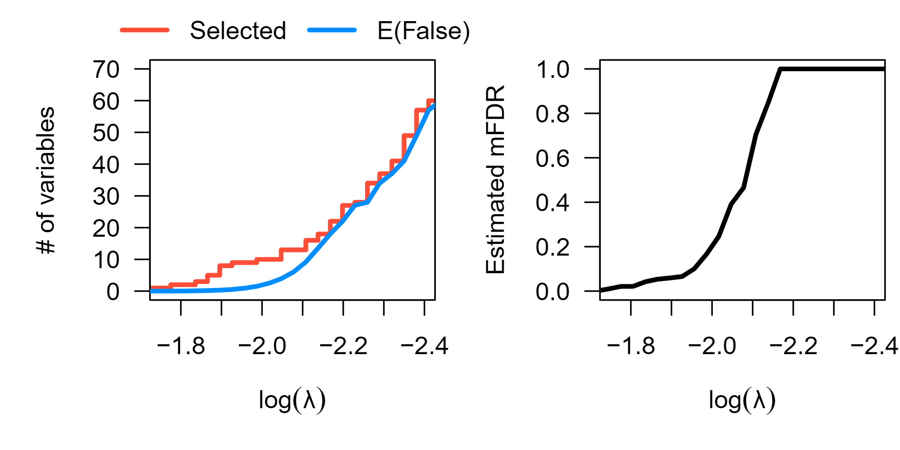
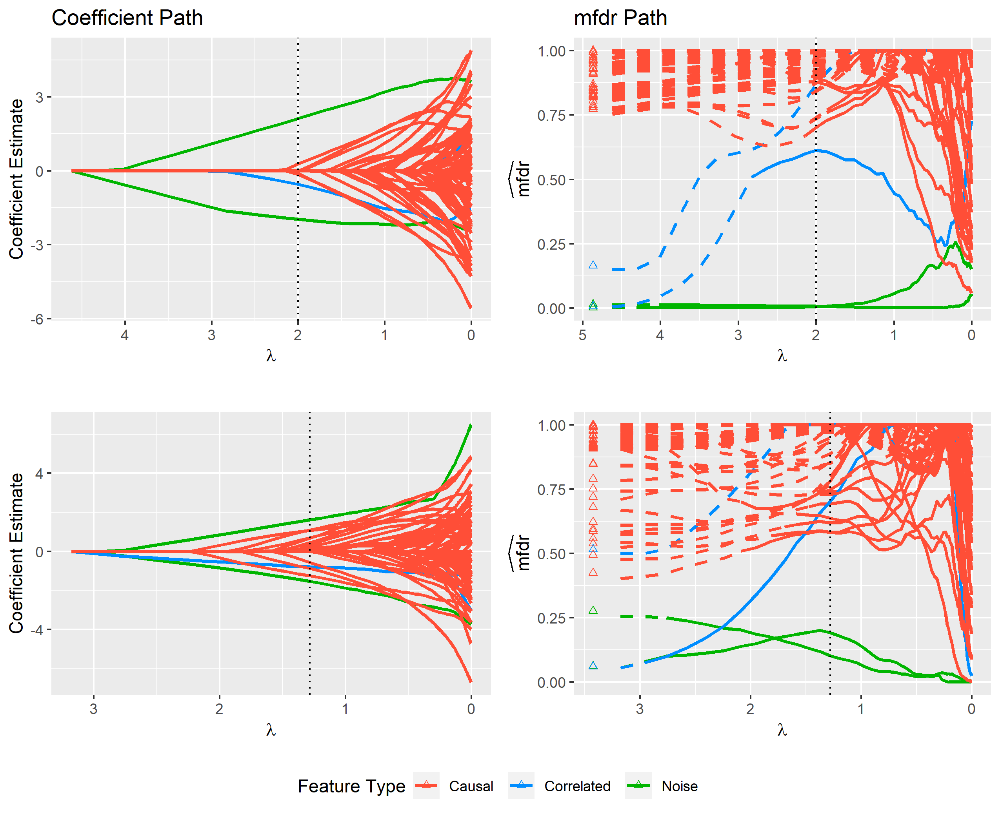
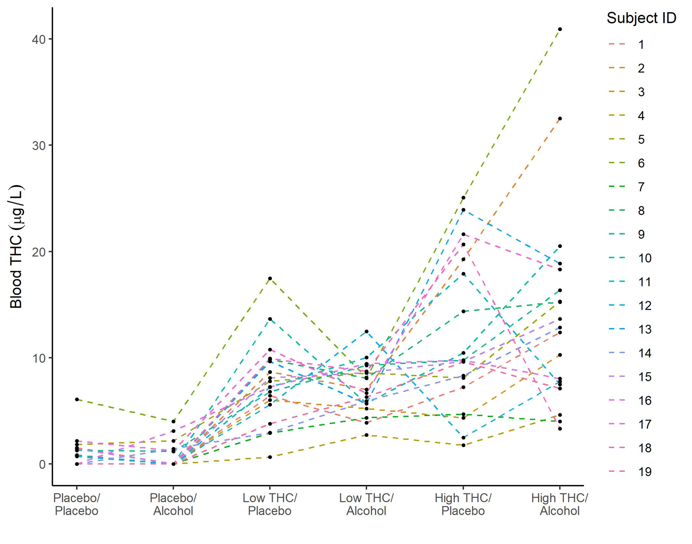
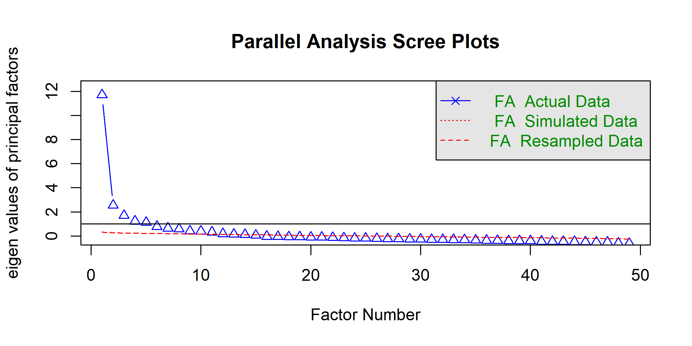

This page highlights a few different areas I've actively contributed towards throughout my career.  

- If you are a Xavier student interested in working with me on a research project over the summer it will most likely be in one of this areas. If anything looks appealing, don't hesitate to talk with me about it after class, during office hours, or via email.  
- Check out [this page](https://www.xavier.edu/undergraduate-research/index) if you are unfamiliar with Xavier's undergraduate research program.

$~$

### 1. False Discovery Rate Methods in High Dimensional Regression Modeling

Many penalized regression methods such as [LASSO](http://statweb.stanford.edu/~tibs/lasso.html), [elastic net](https://en.wikipedia.org/wiki/Elastic_net_regularization), [SCAD, and MCP](http://myweb.uiowa.edu/pbreheny/7600/s16/notes/2-29.pdf), naturally perform variable selection during the model fitting process.  For these models a simple question that an analyst might ask is: "How many of the variables selected by the model are expected to be false discoveries?"

Read more:

- **Marginal false discovery rate control for likelihood-based penalized regression models**, Miller R and Breheny P, *Biometrical Journal*, 2019. [link](https://onlinelibrary.wiley.com/doi/abs/10.1002/bimj.201800138)
- **Feature-specific inference for penalized regression models using local false discovery rates**, Miller R and Breheny P, *In Submission* [arxiv link](https://arxiv.org/pdf/1809.05497.pdf)
- **Marginal false discovery rates for group sparse penalized regression**, Miller R, *Soon to be Submitted*, arxiv link coming soon

$~$

### 2. Statistical Modeling in Drugged Driving Applications

With many states contemplating cannabis legalization, a better understanding of how the drug can impact all of areas of driving performance and is of interest.  The National Advanced Driving Simulator [(NADS)](https://www.nads-sc.uiowa.edu/) conducts cutting-edge research in the area drugged and impaired driving using advanced driving simulator technology that allows for experimental designs that cannot be executed on real roadways.  I have been actively involved in creating statistical models that evaluate the impact of cannabis (and other substances) on driver performance in scenarios involving distracted driving.

Read more:

- **Impact of cannabis and low alcohol concentration on divided attention tasks during driving**, Miller, R, Brown, T, Lee, S, Tibrewal, I, Milavetz, G, Gaffney, G, Hartman, Hartman R, D Gorelick, R Compton, Huestis, M, *Traffic Injury Prevention*, 2020. [https://www.tandfonline.com/doi/abs/10.1080/15389588.2020.1814956]

### 3. Suicide Risk in Cincinnati Area Schools

Mental health is an important factor in student well being and success. In this area, I am currently working in collaboration with the [Dr. Victor Ronis-Tobin](https://www.xavier.edu/population-health/directory/victor-ronis-tobin) and the [1n5](https://1n5.org/) organization to statistically optimize and validate questionnaires that are administered to K-12 students, their parents, and school staff.  

$~$


### 4. Other Interests

A few other areas that I'm interested are: 

- Causal Inference - how can causality be evaluated in observational studies
- Statistics in Sports - how to leverage data and statistical methods to gain new insights in the realm of sports
- Data Science Education - what content belongs in a data science curriculum, and what is the most effective way to teach that content to students

$~$

## Select Data Visualizations

#### Marginal False Discovery Rates

```{r,  echo = FALSE, out.height=300, fig.cap = "Fig 1: The figure above displays marginal false discovery estimates for a series of lasso penalized survival models for the survival outcomes of 442 early-stage lung cancer subjects in response to 22,283 gene expression measurements and additional clinical covariates.  The left panel shows the number of genetic features selected by the lasso relative to the expected number of marginal false discoveries, while the right panel shows the expected marginal false discovery rate of each model."}

```

#### Local Marginal False Discovery Rates

```{r, echo = FALSE, out.height=5, out.height=600, fig.cap = "Fig 2: The figure above displays modeling results from a single simulated data set containing various types of variables (features). The left panel shows the standard LASSO coefficient path that is returned by default from most standard software packages such as glmnet. From this path it is difficult to distinguish between important features and noise. The cross-validated model, which is indicated by the dotted vertical line, contains several noise variables that cannot be easily identified using just the coefficient path. The right panel displays each feature’s local marginal false discovery rate (mfdr) along the same sequence of models. This approach is capable of clearly distinguishing between important variables and noise; the method characterizes each of the noise variables in the cross-validated model as having a greater than 50% chance of being a false discovery."}

```

#### Blood THC Concentrations While Driving

```{r, echo = FALSE, out.height=5, out.height=450, fig.cap = "Fig 3: The figure above shows blood THC concentrations by administered cannabis and alcohol doses during the first occurrence of the side-mirror task for each of the 19 participants. Each line represents a single subject across the six dosing conditions (Pla = Placebo, Alc = Alcohol, Low = Low THC, High = High THC)."}

```

#### Optimization of Suicide Ideation Questionaire

```{r, echo = FALSE, out.height=4, out.height=250, fig.cap = "Fig 4: Parallel analysis is an approach used to inform dimension reduction in questionaires  This plot depicts the results of parallel analysis applied to a suvery of suicide ideation for n=2213 students from 3 Cincinnati-area schools.  The results indicate that 13 principal factors can sufficiently represent the 50+ item questionaire."}

```

