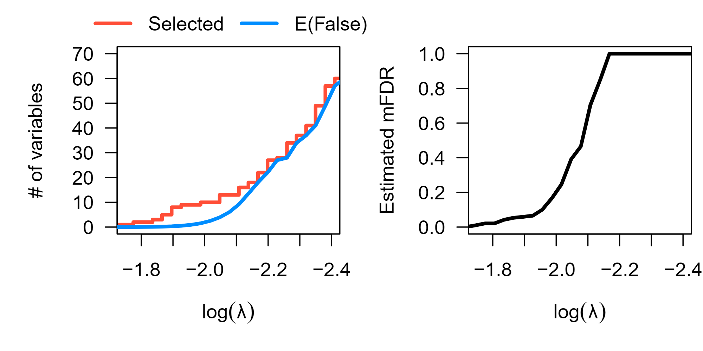
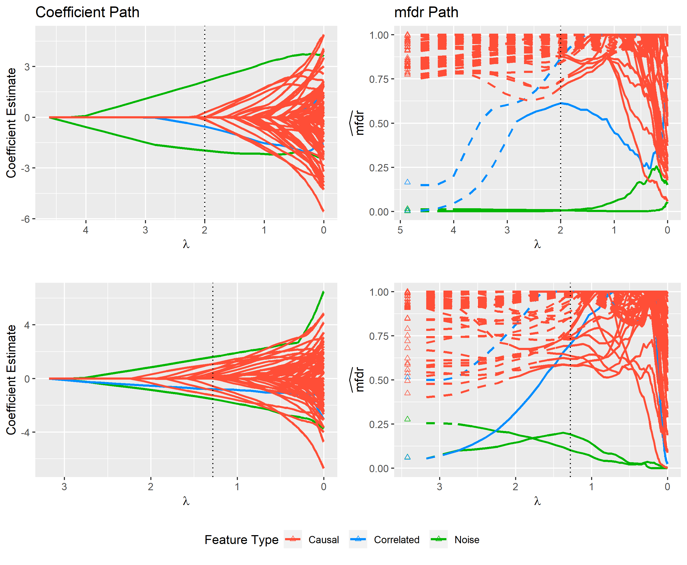
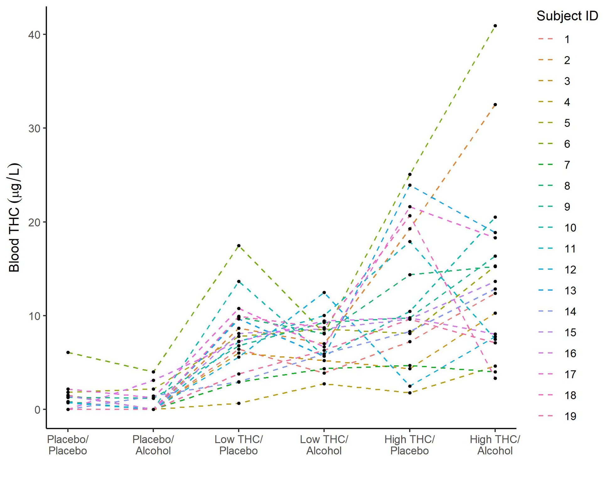
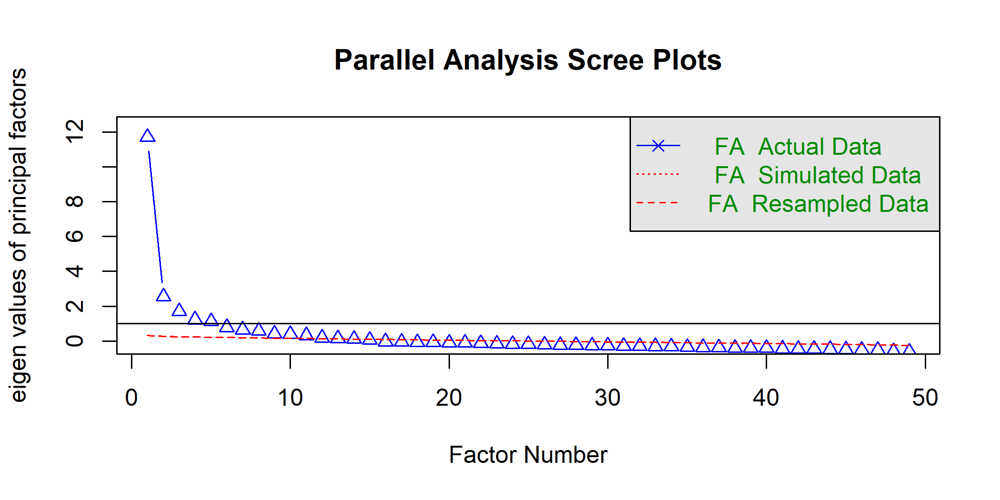

This page highlights a few different research areas where I've made contributions throughout my career. If you are a Grinnell College student interested in working with me on a research project, please read the information below:

1. Most summers I supervise 1-2 research projects involving 2-4 students. Preliminary topics for these projects are determined in early February, but they can be adjusted depending upon student interests and abilities.
2. Summer MAPs currently require a [common application](https://www.grinnell.edu/academics/majors-concentrations/science-division/summer-research) that is advertised by the Science Division Office in February. I encourage you to meet with me (or drop-in during my office hours) if you are interested in applying to work on a Summer MAP with me.
3. Summer MAP applications are competitive, so even if you and I are both interested in a project it is possible that other applicants are better equipped for specific needs of a project. It is my obligation to construct the most effective teams when reading applications and making offers.

$~$

## Current Opportunities

I am currently working on passive detection of drug-impaired driving using machine learning and time-series data streams (ocular and vehicle) from driver monitoring systems. In particular, I'm planning on the following projects for Summer 2026:

1. Understanding and extracting comprehensible eye-movement features using convolution-based deep learning methods (ROCKET and InceptionTime), essentially an explainable AI task.
2. Investigating the performance of machine learning methods trained for alcohol detection on new (unseen) driving environments and new sources of impairment (cannabis and fatigue).

The only necessary requirement for me to consider your application is intermediate-level programming experience in either R or Python (ie: organized projects involving more than just a few lines of data analysis code). Experience in machine learning and/or statistical modeling is desirable, but not required for consideration.

To better understand this line of research, I encourage you to browse the presentation slides linked below:

- [TRB 2026 Annual Meeting](TRB26_ML_ALC_DETECT.pdf)
- [TRB 2024 Annual Meeting](TRB24_slides.pdf)

$~$

## Previous Contributions

### 1. False Discovery Rate Methods in High Dimensional Regression Modeling

Many penalized regression methods such as [LASSO](http://statweb.stanford.edu/~tibs/lasso.html), [elastic net](https://en.wikipedia.org/wiki/Elastic_net_regularization), [SCAD, and MCP](http://myweb.uiowa.edu/pbreheny/7600/s16/notes/2-29.pdf), naturally perform variable selection during the model fitting process.  For these models a simple question that an analyst might ask is: "How many of the variables selected by the model are expected to be false discoveries?"

Read more:

- **Marginal false discovery rate control for likelihood-based penalized regression models**, Miller R and Breheny P, *Biometrical Journal*, 2019. [LINK](https://onlinelibrary.wiley.com/doi/abs/10.1002/bimj.201800138)
- **Feature-specific inference for penalized regression models using local false discovery rates**, Miller R and Breheny P, *Statistics in Medicine*, 2023. [LINK](https://onlinelibrary.wiley.com/doi/full/10.1002/sim.9678)
- **Marginal false discovery rates for group sparse penalized regression**, Miller R, *In progress*, [LINK](https://github.com/remiller1450/grp_mfdr_paper)

$~$

### 2. Statistical Modeling in Drugged Driving Applications

With many states contemplating cannabis legalization, a better understanding of how the drug can impact all of areas of driving performance and is of interest.  The National Advanced Driving Simulator [(NADS)](https://www.nads-sc.uiowa.edu/) conducts cutting-edge research in the area drugged and impaired driving using advanced driving simulator technology that allows for experimental designs that cannot be executed on real roadways.  I have been actively involved in creating statistical models that evaluate the impact of cannabis (and other substances) on driver performance in scenarios involving distracted driving.

Read more:

- **Impact of cannabis and low alcohol concentration on divided attention tasks during driving**, Miller, R, Brown, T, Lee, S, Tibrewal, I, Milavetz, G, Gaffney, G, Hartman, Hartman R, D Gorelick, R Compton, Huestis, M, *Traffic Injury Prevention*, 2020. [LINK](https://www.tandfonline.com/doi/abs/10.1080/15389588.2020.1814956)
- **Influence of cannabis use history on the impact of acute cannabis smoking on simulated driving performance during a distraction task**, Miller, R, Brown, T,  Wrobel, J, Kosnett, M, Brooks-Russell, A, *Traffic Injury Prevention*, 2022. [LINK](https://www.tandfonline.com/doi/full/10.1080/15389588.2022.2072492)
- **Predicting changes in driving performance in individuals who use cannabis following acute use based on self-reported readiness to drive**, Miller, R, Brown, T,  Schmitt, R, Gaffney, G, Milavetz, G, *Accident Analysis and Prevention*, 2024. [LINK](https://www.sciencedirect.com/science/article/abs/pii/S0001457523004232)

$~$

### 3. Other Interests

A few other areas that I'm interested are: 

- Applications in Public Health and Biology - how statistical methods and data analysis can contribute to the understand of biological processes and health outcomes
- Statistics in Sports - how to leverage data and statistical methods to gain new insights in the realm of sports
- Data Science Education - determining the content belongs in a data science curriculum, and what is the most effective way to teach that content to students

$~$

## Select Data Visualizations

#### Marginal False Discovery Rates

```{r,  echo = FALSE, out.height=300, fig.cap = "Fig 1: The figure above displays marginal false discovery estimates for a series of lasso penalized survival models for the survival outcomes of 442 early-stage lung cancer subjects in response to 22,283 gene expression measurements and additional clinical covariates.  The left panel shows the number of genetic features selected by the lasso relative to the expected number of marginal false discoveries, while the right panel shows the expected marginal false discovery rate of each model."}

```

#### Local Marginal False Discovery Rates

```{r, echo = FALSE, out.height=5, out.height=600, fig.cap = "Fig 2: The figure above displays modeling results from a single simulated data set containing various types of variables (features). The left panel shows the standard LASSO coefficient path that is returned by default from most standard software packages such as glmnet. From this path it is difficult to distinguish between important features and noise. The cross-validated model, which is indicated by the dotted vertical line, contains several noise variables that cannot be easily identified using just the coefficient path. The right panel displays each feature’s local marginal false discovery rate (mfdr) along the same sequence of models. This approach is capable of clearly distinguishing between important variables and noise; the method characterizes each of the noise variables in the cross-validated model as having a greater than 50% chance of being a false discovery."}

```

#### Blood THC Concentrations While Driving

```{r, echo = FALSE, out.height=5, out.height=450, fig.cap = "Fig 3: The figure above shows blood THC concentrations by administered cannabis and alcohol doses during the first occurrence of the side-mirror task for each of the 19 participants. Each line represents a single subject across the six dosing conditions (Pla = Placebo, Alc = Alcohol, Low = Low THC, High = High THC)."}

```

#### Optimization of Suicide Ideation Questionaire

```{r, echo = FALSE, out.height=4, out.height=250, fig.cap = "Fig 4: Parallel analysis is an approach used to inform dimension reduction in questionaires  This plot depicts the results of parallel analysis applied to a suvery of suicide ideation for n=2213 students from 3 Cincinnati-area schools.  The results indicate that 13 principal factors can sufficiently represent the 50+ item questionaire."}

```

