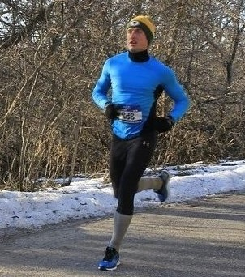

 I was born and raised in the far northwest suburbs of Chicago, which is also where I met my soon to be wife Alissa while working a summer camp.  I've lived nearly all of my life in the Midwest, and I haven't been west of Des Moines or east of Chicago since I was two years old.

I've competed in athletics most of my life and I enjoy lifting weights and running outdoors during my leisure time.  I was a varsity cross country and track and field runner as an undergraduate at Augustana College.  While I'm not nearly as fast as I used to be, I still enjoy running a race or two each year.

A few of my other hobbies include: Listening to music - my top 3 all-time favorite songs are ["Ocean Avenue"](https://www.youtube.com/watch?v=X9fLbfzCqWw) by Yellowcard, ["Mr. Brightside"](https://www.youtube.com/watch?v=gGdGFtwCNBE) by The Killers, and ["I'm Ready"](https://www.youtube.com/watch?v=q1_WMPFaq-4) by Jack's Mannequin, doing crossword puzzles, trivia, following the Green Bay Packers and Iowa Hawkeyes, and watching documentaries or true crime shows like Forensic Files.